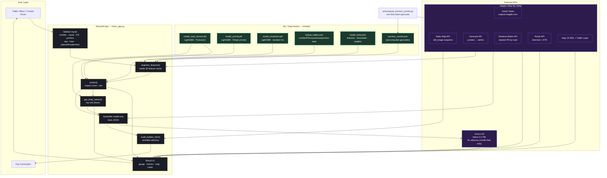
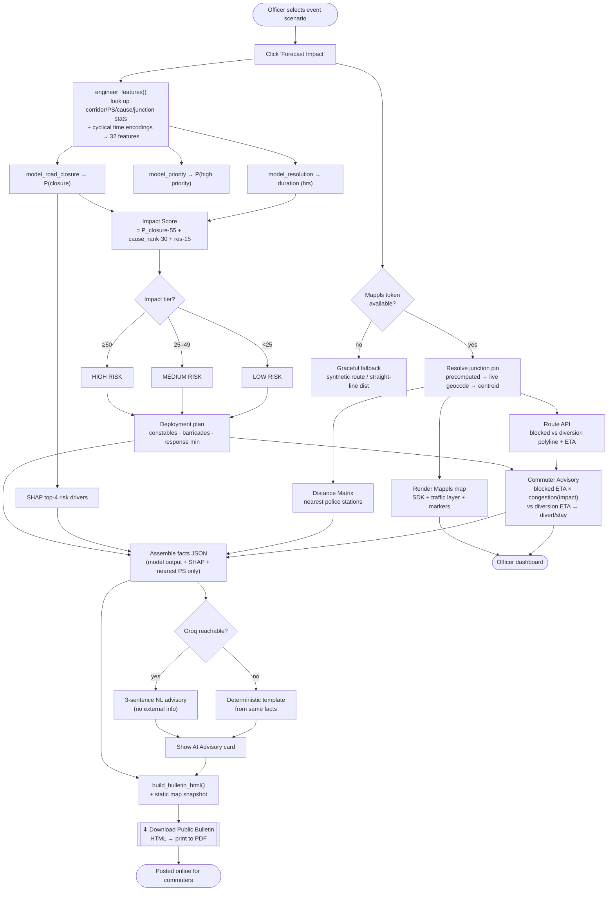

# TRAVIS — Architecture & Flow Diagrams

Diagrams for the **Traffic Risk & Advisory Intelligence System** (Bangalore event-driven
traffic congestion prediction). Rendered from the actual codebase: 3 LightGBM models +
32 engineered features (`model_meta.json`), 6 Mappls integration points, a Groq
natural-language advisory, and a printable public bulletin.

---

## 1. System Architecture

---

## 2. Prediction & Advisory Flow

---

## Component Notes

- **Three independent LightGBM models** feed one weighted **impact score**
  (55 / 30 / 15 weights from `model_meta.json`), which drives the risk tier and the
  rule-based deployment plan.
- **Mappls is used in 6 places** — OAuth token, JS SDK + live traffic layer, Route API,
  Distance Matrix API, Geocode API, and Static Map API. Every call has a graceful
  fallback (synthetic route / straight-line distance / corridor centroid) so the demo
  never breaks offline.
- **The Groq boundary is strict**: it only ever receives the assembled facts JSON
  (model outputs + SHAP drivers + nearest stations) and only produces prose — no
  external data enters the advisory.
- `junction_coords.json` is produced one-time by `precompute_junction_coords.py`; until
  it exists the app falls back to live geocoding → corridor centroid.
